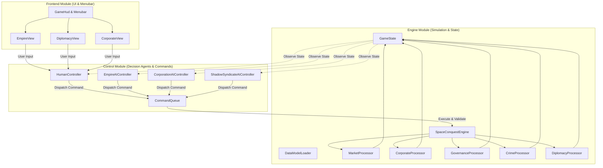

# Requirements

### Overview and goals

This plan defines the architectural design, data models and execution pipelines for implementing all decision-making entities within the space conquest game. The system introduces autonomous, intelligent behavior across five distinct layers of agency:

1. **Sovereign empires:** State governments managing imperial ministries, macro-economic policies (taxes, tariffs, subsidies, nationalization), technology research, military procurement, territorial influence and interstellar diplomacy.
2. **System governors:** System-level administrators providing localized economic synergies, industrial specialization boosts and crime suppression across all celestial bodies in a solar system.
3. **Autonomous private corporations:** Independent profit-driven commercial syndicates scanning logistics networks for market shortcomings ($S_m$), investing capital into infrastructure, funding workforce training, and operating private cargo haulers and mining fleets.
4. **Shadow corporate syndicates and pirates:** Rogue factions emerging from unpoliced black market leakage ($L_{\text{credits}}$), accumulating illicit wealth to illegally construct stealth freighters and pirate raiders that poach asteroid veins and ambush cargo transports.
5. **Citizen cohorts and electorates:** Population groups making micro-economic decisions (spending wages on housing, healthcare and nutrient spread), voting in democratic elections based on systemic shortages, or falling into civil unrest and criminal networks.

---

### Scope

#### In scope
- Data structures and JSON resource schemas for empires, ministerial portfolios, system governors, corporations, commercial hubs, shadow syndicates and diplomatic stances.
- Simulation processors in `engine` for market pricing, shortcoming evaluation ($S_m$), corporate autonomous investment, trade arbitrage with gravity launch tax, crime generation, black market leakage ($L_{\text{credits}}$), and diplomatic influence ($I_v$).
- Ideological governance models: democratic election cycles based on demographic happiness and material shortages, autocratic appointment systems, and hive mind direct command bypass.
- Modular AI controller agents in `control` for AI empires, private corporations and shadow syndicates.
- Command validation and dispatch pipeline allowing both `HumanController` and AI controllers to interact deterministically with `GameEngine`.
- Menubar and HUD integration in `frontend` for inspecting empire cabinets, corporate balance sheets, market hubs and diplomatic statuses.

#### Out of scope
- Real-time tactical 3D fleet battle rendering (tactical space battles use deterministic turn-based resolution).
- Multiplayer network synchronization (single-player architecture with multi-agent simulation).
- Direct procedural generation of custom 3D hull meshes (uses modular 2D slot-based ship design architecture).

---

### Decision making entities and user stories

#### User story 1: Imperial governance and ministries
As a sovereign player or AI ruler, I want to assign ministers to specialized government portfolios (industry, agriculture, technology, defense, finance) so that their professional backgrounds grant empire-wide economic, research or tactical synergy bonuses.

#### User story 2: System governance
As an empire leader, I want to appoint (or have democratic citizens elect) one system governor per solar system so that their background trait accelerates matching industries and suppresses local crime metrics across all planets and moons in that coordinate cluster.

#### User story 3: Autonomous corporate shortcoming resolution
As an individualist or collectivist empire, I want private corporations to dynamically detect local supply deficits (such as silicon or food shortages) and autonomously spend their aggregated capital to construct refineries, subsidize workforce training, and deploy cargo haulers to resolve supply bottlenecks.

#### User story 4: Black market and piracy dynamics
As an empire administrator, I want unpoliced commerce hubs and low-happiness colonies to leak tariffs into shadow corporate capital pools, causing rogue pirate cells to spawn and poach asteroid resources until suppressed by police and naval patrols.

#### User story 5: Dynamic interstellar diplomacy
As a player or AI empire, I want to establish and transition diplomatic relationships through five distinct tiers (Total war, Cold war, Neutral, Commercial alliance, Integrated federation) to dictate fleet engagement rules, bilateral tariff reductions, and logistics sharing.

---

### Functional requirements

#### 1. Sovereign empires and ministries
- Empires maintain an ideological alignment (`societyStructure`: Individualist, Collectivist or Hive Mind), liquid public treasury credits, technology research progress, territorial range of influence, and diplomatic stances.
- The imperial cabinet consists of five portfolios:
  - *Ministry of industry and refining:* Boosts vein extraction rates and alloy processing speeds (optimal backgrounds: `industrial_worker`, `miner` or `bureaucrat`).
  - *Ministry of agricultural and biosphere stability:* Boosts food production yields and nutrient spread happiness modifiers (optimal backgrounds: `farmer` or `bureaucrat`).
  - *Ministry of technology and technological application:* Accelerates research speeds and lowers upgrade complexity ratings (optimal backgrounds: `scientist` or `bureaucrat`).
  - *Ministry of defense and logistics procurement:* Boosts soldier ground combat strength and shortens spaceframe build times (optimal backgrounds: `soldier`, `engineer` or `bureaucrat`).
  - *Ministry of finance and central commerce:* Increases transaction tariff collection efficiency across commercial hubs (optimal background: `bureaucrat`).
- Citizens trained as `bureaucrats` grant a universal baseline administrative bonus to any portfolio.
- Hive minds completely bypass ministries, system governors and elections.

#### 2. System governors and granular solar system administration
- Exactly one governor can be assigned per solar system.
- The governor's background bonus applies across all planets, moons, asteroid outposts and space stations within the system.
- Governors apply a system-wide crime reduction modifier and boost local `police` efficiency.
- In autocracies, the player or AI ruler appoints governors directly.
- In democracies, governors and ministers are elected periodically by local citizen cohorts based on happiness and critical resource shortages (e.g., severe food deficits cause citizens to elect a `farmer`).

#### 3. Private corporations and market shortcoming engine
- Corporations possess an ID, name, headquarters, liquid capital reserves, asset holdings, and market orientation (extraction, metallurgy, agriculture, transportation, consumer services).
- Every turn, corporations evaluate the **Shortcoming Score ($S_m$)** across accessible commercial hubs within their logistics range:
  $$S_m = \left( \frac{\text{Local Demand} - \text{Local Supply}}{\text{Local Supply} + \epsilon} \right) \times \text{Market Price Modifier}$$
- When $S_m$ exceeds investment thresholds:
  - Infrastructure: Corporations spend capital to construct or expand matching industrial facilities.
  - Workforce: Corporations fund training programs for low-skill citizens into specialized professions (`miners`, `technicians`, `logistics_officers`).
  - Logistics: Transport corporations buy `Cargo Transport` blueprints and establish trade routes to arbitrage price differentials between surplus and deficit hubs.
  - Mining: Extraction corporations buy `Mine Ship` blueprints to extract raw ores from asteroid fields and low-G moons.
- Corporate trade routes automatically deduct the planetary launch gravity tax (credits per kilogram based on surface gravity and atmospheric pressure) when exporting from terrestrial surfaces.

#### 4. Commercial hubs, taxes and state interventions
- Every planet and space station with a commerce module functions as a commercial hub with a transaction tariff rate, storage capacity linkage, and logistics range.
- The state collects passive revenue from citizen retail purchases, corporate B2B trading, and docking fees.
- Macro-economic policies:
  - Corporate tax rate: Adjusts capital retention in corporate investment pools vs public treasury.
  - Zoning laws: Locks planetary surface slots against private construction.
  - Sector subsidies: Provides tax credits or cash grants to specific corporate identifiers.
  - Nationalization: State requisition of private cargo fleets or foundries during emergencies (causes massive corporate trust drop and citizen unhappiness in democracies).

#### 5. Crime, black market leakage and piracy
- Commercial density, logistical berths, and consumer goods or nutrient shortages increase local crime metrics.
- Stationing the `police` profession and appointing system governors reduces crime.
- When crime exceeds local security thresholds, **Black Market Leakage ($L_{\text{credits}}$)** triggers:
  $$L_{\text{credits}} = \text{Total Gross Hub Transaction Value} \times \text{Transaction Tariff Rate} \times \left( \frac{\text{Local Crime Metric}}{\text{Local Police Efficiency} + \epsilon} \right)$$
- Siphoned credits aggregate into autonomous **Shadow Capital Pools**.
- Shadow syndicates use accumulated wealth to illegally construct stealth cargo freighters and rogue mine ships from local shipyard capacity, poaching un-depleted asteroid veins and ambushing unescorted cargo transports.
- Crews for pirate ships are recruited from citizens dropping out of the registered workforce due to poverty or low happiness.
- Hive minds are 100% immune to crime, black market leakage and internal pirate spawning.

#### 6. Diplomatic relations and territorial sovereignty
- Every populated colony and deep space station projects an **Influence Value ($I_v$)**:
  $$I_v = \left( \log_{10}(\text{Total System Population}) \times \text{Module Development Factor} \right) + \text{Military Hangar Modifier}$$
- Diplomatic relations operate across five tiers:
  - *Total war:* Automatic military engagement on sight, orbital bombardment, ground invasion, decoupled economies.
  - *Cold war / blockade:* Closed borders to public assets, military vessel scanning, commerce hubs deny foreign docking, private assets risk seizure.
  - *Neutral state:* Standard transit, commercial docking permitted with standard docking fees and transaction tariffs.
  - *Commercial alliance:* Bilateral trade treaties, mutual transaction tariff reductions, autonomous corporate cross-border arbitrage.
  - *Integrated federation:* Unified logistics range, shared station repairs, ordnance resupply from allied storage pools.
- Interstellar trade enforces nutrient compatibility: organic food cannot be consumed by incompatible species (e.g., silicon lithovores) unless routed through a space station with a *Xenobiology Lab*. Raw inorganic elements and manufactured spaceframe components trade freely.

---

### Non-functional requirements
- **Determinism and state immutability:** Game logic simulation produces identical results given the same initial state and command sequence.
- **Performance:** Multi-agent decision updates (empires, corporations, pirates) execute in under 50 ms per turn tick for a galaxy of 50+ solar systems.
- **Moddability:** All empire archetypes, corporate templates and ministerial portfolio definitions are loaded from external JSON files without hard-coded numbers.
- **Save game persistence:** Complete runtime state of all decision entities is fully serialized into JSON save files.

# Technical Design

### Current implementation

- `engine`:
  - Static data models loaded via `DataModelLoader` from JSON property files (`solar_systems.json`, `races.json`, `materials.json`, `technologies.json`, `professions.json`, `star_properties.json`).
  - Immutable Java records for astronomical entities (`SolarSystem`, `Planet`, `Moon`, `AsteroidBelt`, `Population`, `Material`, `Race`, `Profession`).
  - `PopulationProcessor`: Calculates demographic aging and fertility reproduction per race.
  - `SpaceConquestEngine`: Manages turn advancement and population updates.
  - `GameState`: Holds turn number, status string and list of `SolarSystem` instances.
- `control`:
  - `Controller`: Simple interface with `onGameStateUpdate(GameState)`.
  - `HumanController`: Logs received turn updates.
- `frontend`:
  - FXGL-based application rendering solar systems, camera navigation, zoom levels and navigation menubar (`Empire`, `Diplomacy`, `Technology`, `Ships & Bases`, `Galaxy View`, `Game Menu`).

---

### Key decisions

1. **Decoupled controller agent architecture:**
   - *Decision:* Decision entities (AI empires, corporations, shadow syndicates) run as autonomous controller agents in the `control` module, observing `GameState` and issuing validated command records to `GameEngine`.
   - *Rationale:* Keeps the simulation engine deterministic, headless-testable and free from direct AI logic coupling, while allowing the same command interface to serve human UI input and AI actions.
2. **Utility scoring based on design formulas:**
   - *Decision:* Corporate investment, trade route selection, and demographic elections use mathematical utility formulas ($S_m$, $L_{\text{credits}}$, $I_v$, launch gravity cost) parameterized by ideological alignment and market orientation.
   - *Rationale:* Matches the exact hard sci-fi economic mechanics defined in the project specifications and avoids unbounded state-space searches.
3. **Hybrid JSON archetypes + dynamic runtime records:**
   - *Decision:* Preset archetypes (`empires.json`, `corporations.json`, `ministries.json`) loaded by `DataModelLoader` initialize dynamic entity records in `GameState`, serialized cleanly by `SaveGameManager`.
   - *Rationale:* Preserves moddability and separation of data from code while supporting full dynamic state mutation across turn cycles.

---

### Architecture diagram



---

### Data models and contracts

#### 1. Core entity records in `com.spaceconquest.engine`

```java
public record Empire(
    String id,
    String name,
    String raceId,
    String societyStructure, // "Individualist", "Collectivist", "Hive Mind"
    double treasuryCredits,
    double corporateTaxRate,
    List<String> controlledSystemIds,
    List<MinistryAssignment> ministries,
    Map<String, String> systemGovernorAssignments,
    List<String> unlockedTechIds,
    List<String> activeShipDesignIds
) {}

public record MinistryAssignment(
    String portfolioId,
    String assignedCitizenProfessionId,
    double calculatedEfficiencyModifier
) {}

public record SystemGovernor(
    String id,
    String name,
    String solarSystemId,
    String professionId,
    double efficiencyBonus,
    double crimeReductionBonus
) {}

public record Corporation(
    String id,
    String name,
    String empireId,
    String headquartersEntityId,
    String marketOrientation, // "EXTRACTION", "METALLURGY", "AGRICULTURE", "TRANSPORT", "CONSUMER"
    double liquidCapitalReserves,
    List<String> ownedFacilityIds,
    List<String> ownedShipIds,
    List<String> claimedVeinIds
) {}

public record CommercialHub(
    String id,
    String entityId,
    double transactionTariffRate,
    double storageCapacityKg,
    double currentStoredWeightKg,
    double logisticsRangeUnits,
    Map<String, MarketOrder> activeOrders
) {}

public record MarketOrder(
    String resourceId,
    double supplyKg,
    double demandKg,
    double pricePerKg,
    double shortcomingScore
) {}

public record ShadowSyndicate(
    String id,
    String name,
    String empireId,
    String baseSystemId,
    double shadowCapitalPool,
    List<String> rogueShipIds
) {}

public record DiplomaticRelation(
    String empireAId,
    String empireBId,
    String tier, // "TOTAL_WAR", "COLD_WAR", "NEUTRAL", "COMMERCIAL_ALLIANCE", "INTEGRATED_FEDERATION"
    double mutualTariffDiscount
) {}
```

#### 2. Command contracts in `com.spaceconquest.control`

```java
public interface GameCommand {
    boolean validate(GameState state);
    GameState apply(GameState state);
}

public record SetTariffRateCommand(String empireId, String hubId, double newRate) implements GameCommand { ... }
public record SubsidizeCorporationCommand(String empireId, String corporationId, double grantCredits) implements GameCommand { ... }
public record AppointMinisterCommand(String empireId, String portfolioId, String professionId) implements GameCommand { ... }
public record AssignGovernorCommand(String empireId, String systemId, String professionId) implements GameCommand { ... }
public record SetDiplomaticTierCommand(String empireAId, String empireBId, String newTier) implements GameCommand { ... }
public record NationalizeAssetCommand(String empireId, String assetId) implements GameCommand { ... }
public record CorporateInvestCommand(String corporationId, String entityId, String investmentType, double credits) implements GameCommand { ... }
```

---

### Components and module layout

#### `engine` module additions
- `com.spaceconquest.engine.market`:
  - `MarketProcessor`: Computes local market prices, supply-demand delta, transaction tariff skim, and gravity tax penalties.
  - `CorporateInvestmentProcessor`: Calculates Shortcoming Score ($S_m$) and triggers industry expansion, profession training subsidies, and ship orders.
  - `CorporateFleetProcessor`: Directs autonomous mine ships to asteroid veins and cargo haulers across trade corridors.
  - `CrimeProcessor`: Simulates crime growth, police suppression, black market leakage ($L_{\text{credits}}$), shadow capital pooling, and pirate cell spawning.
- `com.spaceconquest.engine.governance`:
  - `GovernanceProcessor`: Computes ministerial portfolio bonuses, governor solar system modifiers, and profession synergy multipliers.
  - `IdeologicalAccessionManager`: Handles democratic periodic election cycles (voting based on shortages and happiness), autocratic appointments, and hive mind bypass logic.
  - `DiplomacyProcessor`: Computes territorial range of influence ($I_v$), manages diplomatic tiers, enforces trade barriers, and executes xenobiology food conversions.
  - `GroundCombatProcessor`: Resolves planetary invasions, garrison mobilization, conscription edicts, and governor defense traits.

#### `control` module additions
- `com.spaceconquest.control.ai`:
  - `EmpireAIController`: Evaluates macro-budget allocations, technology research priorities, diplomatic proposals, and military fleet construction.
  - `CorporationAIController`: Dispatches corporate investment commands, contract bids, and trade orders.
  - `ShadowSyndicateAIController`: Manages illicit shipyard leasing, asteroid vein poaching, and cargo transport ambush vectors.
- `com.spaceconquest.control.command`:
  - `CommandQueue`: Thread-safe staging queue validating and executing player and AI commands during turn boundary processing.

#### `frontend` module additions
- `com.spaceconquest.frontend.views`:
  - `EmpireView`: Displays imperial ministry cabinet, governor assignments, macro-economic tax sliders, and citizen happiness indicators.
  - `CorporateView`: Lists registered corporations, market orientations, liquid capital, shortcomings ($S_m$), and asset registries.
  - `DiplomacyView`: Interactive galactic diplomacy matrix displaying diplomatic tiers, influence borders, and active trade treaties.
  - `CommercialHubView`: Commodity pricing boards, supply-demand bars, tariff deductions, and gravity launch tax readouts.

---

### File structure

```
engine/src/main/
├── java/com/spaceconquest/engine/
│   ├── Empire.java
│   ├── MinistryPortfolio.java
│   ├── SystemGovernor.java
│   ├── Corporation.java
│   ├── CommercialHub.java
│   ├── MarketOrder.java
│   ├── ShadowSyndicate.java
│   ├── DiplomaticRelation.java
│   ├── governance/
│   │   ├── GovernanceProcessor.java
│   │   ├── IdeologicalAccessionManager.java
│   │   ├── DiplomacyProcessor.java
│   │   └── GroundCombatProcessor.java
│   └── market/
│       ├── MarketProcessor.java
│       ├── CorporateInvestmentProcessor.java
│       ├── CorporateFleetProcessor.java
│       └── CrimeProcessor.java
└── resources/
    ├── empires.json
    ├── corporations.json
    └── ministries.json

control/src/main/java/com/spaceconquest/control/
├── ai/
│   ├── EmpireAIController.java
│   ├── CorporationAIController.java
│   └── ShadowSyndicateAIController.java
└── command/
    ├── GameCommand.java
    ├── CommandQueue.java
    ├── SetTariffRateCommand.java
    ├── AppointMinisterCommand.java
    ├── AssignGovernorCommand.java
    ├── SetDiplomaticTierCommand.java
    ├── SubsidizeCorporationCommand.java
    └── CorporateInvestCommand.java

frontend/src/main/java/com/spaceconquest/frontend/
├── EmpireView.java
├── CorporateView.java
├── DiplomacyView.java
└── CommercialHubView.java
```

---

### Risks and mitigations

- **Risk: Economic runaway or deflation loops:** Corporations accumulating unbounded capital or going bankrupt simultaneously.
  - *Mitigation:* Cap corporate investment velocity per turn and enforce a dynamic floor where bankrupt corporations dissolve or are restructured by state subsidies.
- **Risk: Calculation bottlenecks during turn ticks:** Evaluating shortcoming scores ($S_m$) across every material on every celestial body.
  - *Mitigation:* Restrict corporate evaluation passes strictly to nodes within the corporation's active `logisticsRange` and cache market supply-demand summaries per system.
- **Risk: Democratic election flip-flopping:** Rapid oscillation of elected ministers due to single-turn resource fluctuations.
  - *Mitigation:* Implement fixed election term lengths (e.g., every 5 game years) and use moving-average happiness and shortage metrics.

# Testing

### Validation approach

Verification will be conducted through automated unit and integration tests across the `engine` and `control` modules, simulating single-turn and multi-turn game loops to ensure deterministic behavior, mathematical accuracy of economic formulas, and correct agent decision responses.

---

### Key scenarios

#### 1. Corporate market shortcoming resolution pass
- *Setup:* Initialize a solar system where Planet A has an acute shortage of `refined_silicon` (high local demand, low supply) and Planet B has a surplus.
- *Execution:* Advance the simulation loop by 5 turns.
- *Expected outcome:* A metallurgy or transport corporation calculates a high $S_m$, allocates liquid capital to contract a `Cargo Transport`, loads silicon at Planet B, pays the planetary gravity launch fee, lands at Planet A, sells the cargo, skims the state transaction tariff, and earns net profit.

#### 2. Ideological accession and ministerial synergies
- *Setup:* Test both democratic and autocratic empires with various citizen cohorts.
- *Execution:*
  - In a democracy with severe food shortages, trigger an election cycle.
  - In an autocracy, appoint a `scientist` to the Ministry of Technology.
- *Expected outcome:*
  - Democratic population cohorts vote to elect a candidate with a `farmer` background to the agricultural ministry.
  - The autocratic appointment of `scientist` grants the full Expertise Synergy Bonus (1.25x research speed multiplier) whereas a `bureaucrat` yields the baseline bonus (1.10x).

#### 3. Black market leakage and pirate spawning
- *Setup:* Create a high-volume commerce hub with 0 stationed `police` and high crime.
- *Execution:* Run transaction updates over multiple turns.
- *Expected outcome:* A portion of the transaction tariff is siphoned into a `ShadowSyndicate` capital pool ($L_{\text{credits}}$). When capital threshold is met, the syndicate leases local shipyard capacity to construct an unregistered rogue mine ship and deploys it to poach nearby asteroid fields.

#### 4. Diplomatic tier transitions and tariff adjustments
- *Setup:* Two empires with initial Neutral diplomatic posture.
- *Execution:* Transition diplomatic status to Commercial Alliance, then to Total War.
- *Expected outcome:*
  - Commercial Alliance lowers mutual transaction tariff rates and allows autonomous corporate cross-border trade.
  - Total War immediately decouples markets, closes commerce hubs to foreign flags, and flags military fleets for engage-on-sight.

---

### Edge cases

- **Hive mind zero-market immunity:** Verify that hive mind worlds generate 0 baseline crime, do not collect taxes, do not experience black market leakage, and do not hold democratic elections or ministerial cabinets.
- **Extreme gravity tax barriers:** Verify that trading heavy elements (e.g., `lead`, `iron_ore`) from a hyper-gravity terrestrial planet with dense atmosphere correctly calculates the launch penalty and causes corporate AI to reject unprofitable trades.
- **Nutrient incompatibility barrier:** Verify that organic food trade between carbon humanoids and silicon lithovores is blocked unless a space station with a *Xenobiology Lab* and trained `scientists` is present on the transit route.
- **Zero-capital corporation behavior:** Verify that corporations with depleted capital reserves safely enter an idle evaluation state without throwing exceptions or executing unauthorized purchases.

---

### Test changes

- `engine/src/test/java/com/spaceconquest/engine/`:
  - `DataModelLoaderTest.java`: Add tests for loading `empires.json`, `corporations.json` and `ministries.json`.
  - `MarketProcessorTest.java`: Validate shortcoming score ($S_m$), price discovery, transaction tariffs and gravity launch tax formulas.
  - `CorporateProcessorTest.java`: Validate corporate investment triggers, shipyard orders and fleet trade execution.
  - `CrimeProcessorTest.java`: Validate crime generation, police suppression, black market leakage ($L_{\text{credits}}$) and shadow syndicate creation.
  - `GovernanceProcessorTest.java`: Validate ministerial portfolio bonuses, governor system modifiers and election cycle resolutions.
  - `DiplomacyProcessorTest.java`: Validate influence radius ($I_v$), diplomatic tier state machine and xenobiology food trade barriers.
- `control/src/test/java/com/spaceconquest/control/`:
  - `EmpireAIControllerTest.java`: Validate empire AI macro-budget allocation and command dispatch.
  - `CorporationAIControllerTest.java`: Validate corporate AI trade routing and investment decisions.
  - `CommandQueueTest.java`: Validate game command validation, queue execution and state immutability.

# Delivery Steps

### ✓ Step 1: Define core decision entity data models, JSON schemas and serialization in engine
The `engine` module defines immutable Java records and JSON loaders for empires, ministerial portfolios, system governors, corporations, market hubs and shadow syndicates.

- Create Java records in `com.spaceconquest.engine`: `Empire`, `MinistryPortfolio`, `SystemGovernor`, `Corporation`, `CommercialHub`, `MarketOrder`, `ShadowSyndicate` and `DiplomaticRelation`.
- Add JSON configuration resource files in `engine/src/main/resources`: `empires.json`, `corporations.json` and `ministries.json`.
- Extend `DataModelLoader` with cached loading methods for empires, corporations and ministries (`loadEmpires()`, `loadCorporations()`, `loadMinistries()`).
- Update `GameState` and `SaveGameManager` to include active empire, corporate, governor and diplomatic state registries.
- Add unit tests in `DataModelLoaderTest` and `GameStateTest` verifying JSON deserialization and state serialization integrity.

### ✓ Step 2: Implement autonomous economic and market decision engines in the simulation loop
The `engine` module dynamically processes market shortcoming scores ($S_m$), corporate investment allocations, autonomous transport/mining loops, and black market leakage during the turn simulation.

- Implement `MarketProcessor` to calculate local supply, demand, prices, transaction tariffs and planetary gravity export taxes at commercial hubs.
- Implement `CorporateInvestmentProcessor` to evaluate shortcoming scores ($S_m$) and trigger autonomous corporate investments (infrastructure expansion, profession training subsidies, shipyard procurement).
- Implement `CorporateFleetProcessor` to manage autonomous routing of corporate-owned cargo haulers and mining ships between asteroid fields and commercial hubs.
- Implement `CrimeProcessor` to compute local crime metrics, police suppression, black market leakage ($L_{\text{credits}}$), shadow capital accumulation and pirate fleet spawning.
- Wire all market and economic processors into `SpaceConquestEngine.update()`.
- Add comprehensive unit tests in `MarketProcessorTest`, `CorporateProcessorTest` and `CrimeProcessorTest` verifying economic formulas and fleet behavior.

### ✓ Step 3: Implement empire governance, ideological accession and diplomatic state machines
The `engine` and `control` modules execute ministerial synergies, democratic election cycles, autocratic appointments, system governor bonuses, and 5-tier diplomatic state transitions.

- Implement `GovernanceProcessor` to apply empire-wide ministerial synergy bonuses and system-wide governor efficiency and crime-suppression modifiers.
- Implement `IdeologicalAccessionManager` supporting democratic election cycles driven by population happiness/shortages, direct autocratic appointments, and hive mind bypass logic.
- Implement `DiplomacyProcessor` managing the 5 diplomatic tiers (Total war, Cold war, Neutral, Commercial alliance, Integrated federation), calculating dynamic territorial influence radius ($I_v$), and enforcing trade barriers and xenobiological food conversion requirements.
- Implement `GroundCombatProcessor` resolving planetary sieges, workforce mobilization, militia conscription, and governor combat bonuses.
- Add unit tests in `GovernanceProcessorTest`, `DiplomacyProcessorTest` and `GroundCombatProcessorTest` validating leadership calculations and diplomatic interactions.

### ✓ Step 4: Build AI controller agents in control module and integrate command execution with frontend UI
The `control` module provides autonomous AI decision agents and command pipelines, and the `frontend` displays interactive status panels for empires, corporations, markets and diplomacy.

- Implement command records in `com.spaceconquest.control`: `SetTariffRateCommand`, `SubsidizeCorporationCommand`, `AssignGovernorCommand`, `AppointMinisterCommand`, `SetDiplomaticTierCommand` and `NationalizeAssetCommand`.
- Implement autonomous AI controllers in `com.spaceconquest.control`: `EmpireAIController`, `CorporationAIController` and `ShadowSyndicateAIController` that observe `GameState` and dispatch validated commands to `GameEngine`.
- Update `HumanController` and `Controller` interface to handle interactive player command dispatch and state notifications.
- Update frontend views in `com.spaceconquest.frontend`: enrich `Menubar` navigation panels (`Empire`, `Diplomacy`, `Ships & Bases`), add corporate registry details, and display market commodity prices.
- Add integration tests verifying end-to-end command execution and multi-turn AI simulation stability.