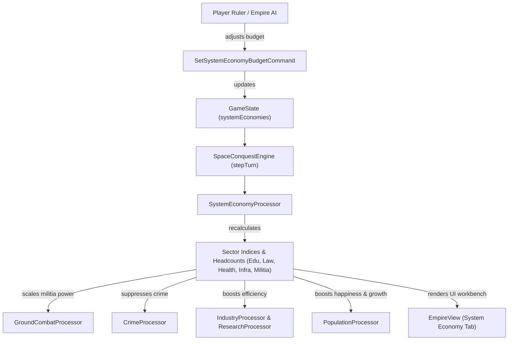

# Requirements

### Overview and goals
The objective of this plan is to implement the **System economy level** across the simulation engine, command control pipeline and frontend interface, as specified in `Empire.md`, `GroundCombat.md` and `frontend/MODULE.md`.

In addition to imperial macro-economics, economic governance is executed at the solar system level. Each solar system controlled by an empire maintains an adjustable public economy distributed across five core sectors: **Education**, **Law and order**, **Health and welfare**, **Infrastructure** and **Planetary militias**. Each sector drives specific societal metrics, profession employment headcounts (teachers, scientists, police, medics, engineers, technicians and soldiers), population happiness, local crime suppression, industrial/science throughput and planetary defense effectiveness during ground sieges.

In `EmpireView`, the Economy tab will feature a view switcher between the **Imperial economy** overview and the **System economy** workbench, allowing players to select any controlled solar system, inspect local revenue streams and expenditures, adjust sector budget allocation sliders and commit budget policies via command dispatching.

### Scope
#### In scope
- **System economy data model and persistence**:
  - Introduce `SystemEconomy` record in `engine` tracking sector allocation percentages/shares, total budget credits, accumulated militia investment history, sector efficiency indices and dynamic employee headcounts per profession.
  - Extend `GameState`, `SaveGame` and `SaveGameManager` to persist and load system economy state across turns and game saves.
  - Generate default balanced system economy profiles during galaxy generation and engine startup for all controlled and populated star systems.
- **Turn-based simulation processing (`SystemEconomyProcessor`)**:
  - Compute per-capita spending and effective sector indices ($E_{\text{edu}}$, $E_{\text{law}}$, $E_{\text{health}}$, $E_{\text{infra}}$, $E_{\text{militia}}$).
  - Calculate profession employment quotas for `teacher`, `scientist`, `police`, `medic`, `engineer`, `technician` and `soldier` based on sector funding.
  - Compute population happiness modifiers (positive for well-funded sectors, negative for austerity/underfunded sectors).
  - Track historical cumulative militia investment ($I_{\text{militia}}$) with turn-based decay, representing past military readiness and training.
- **Cross-processor systemic integration**:
  - **Ground combat (`GroundCombatProcessor`)**: Scale conscripted auxiliary militia combat power dynamically using the system's `accumulatedMilitiaInvestment` rather than a static 0.50 multiplier, rewarding prior military investment when emergency conscription is enacted.
  - **Crime suppression (`CrimeProcessor`)**: Apply system law and order funding level as an active crime reduction modifier alongside stationed police and governor bonuses.
  - **Population health and demographics (`PopulationProcessor`)**: Apply health and welfare indices to population growth rates, disease resistance and morale.
  - **Industrial and research throughput (`IndustryProcessor` & `ResearchProcessor`)**: Apply infrastructure efficiency multipliers to raw mineral extraction, factory output and science generation.
- **Command control pipeline**:
  - Create `SetSystemEconomyBudgetCommand` in `control` enabling players and AI controllers to adjust sector allocation ratios and total system budget funding rates.
  - Support autonomous budget balancing in `EmpireAIController` based on empire ethics and situational crises (e.g., boosting militia during wartime or law and order during crime surges).
- **Frontend UI workbench (`EmpireView`)**:
  - Add a sub-navigation toggle in the Economy tab to switch between **Imperial economy** and **System economy**.
  - Provide a system selector dropdown to choose between any star system controlled by the player's sovereign empire.
  - Render a system economy overview card displaying system population, colonized celestial bodies, local gross economic output, total revenues, total expenditures and net budget balance.
  - Provide interactive allocation controls (sliders, percentage spinners and preset distribution buttons) for Education, Law and order, Health and welfare, Infrastructure and Planetary militias.
  - Provide budget funding rate controls (e.g., Standard 100%, High Investment 150%, Austerity 50% or custom credit budget).
  - Display live projected metrics: sector spending, sector efficiency indices, employed profession quotas, happiness modifiers, crime reduction and militia combat readiness.
  - Provide an "Apply and save system budget" button dispatching `SetSystemEconomyBudgetCommand` through `HumanController`.
  - Display system-specific revenue breakdowns (colonial taxes, local corporate tariffs, space elevator fees, mining royalties, state industry) and expense breakdowns (sector funding, governor & municipal administration, power grid upkeep, station maintenance).
- **Automated testing and documentation**:
  - Unit tests for `SystemEconomyProcessor`, `SetSystemEconomyBudgetCommand`, updated `GroundCombatProcessor` militia scaling, `CrimeProcessor` law and order suppression, `EmpireView` system economy tab and JSON save/load serialization.
  - Update `engine/MODULE.md`, `control/MODULE.md` and `frontend/MODULE.md` documentation in sentence case.

#### Out of scope
- Setting planetary tax rates at the system economy level (tax rates remain governed per colony).
- Hive Mind societies utilizing currency budgets (Hive Minds bypass private sector budgets and operate under uniform state command).

### User stories
- As an imperial ruler, I want to manage public spending at the solar system level so that I can tailor investments in education, security, healthcare, infrastructure and planetary defense to each system's strategic role.
- As a player, I want high investment in education and healthcare to improve population intelligence, teacher/medic employment and civilian happiness so that my colonies grow and innovate faster.
- As a player, I want funding in law and order to reduce crime across all celestial bodies in the system so that black market leakage and pirate threats are minimized.
- As a player, I want spending on infrastructure to boost the efficiency of mines, factories and laboratories across the entire star system.
- As a military commander, I want investment in planetary militias to train a larger pool of soldiers and ensure emergency conscripted militias fight effectively during ground invasions.
- As a player, I want an intuitive sub-view switcher in the Empire view economy tab with responsive sliders and live metric previews so that I can easily balance system budgets.

### Functional requirements
1. **System economy model and sectors**:
   - Each controlled solar system has a `SystemEconomy` state with 5 adjustable sector allocations summing to 100% (or proportional weights):
     - **Education**: Increases teacher and scientist employment, improves citizen intelligence and generates positive happiness.
     - **Law and order**: Increases police employment, suppresses localized crime metrics and generates positive happiness.
     - **Health and welfare**: Increases medic employment, improves health and population growth, reduces mortality and boosts morale.
     - **Infrastructure**: Increases engineer and technician employment, enhances resource extraction, industrial throughput and scientific research output.
     - **Planetary militias**: Increases soldier employment and recruitable pool, provides local defensive stability and boosts militia combat multiplier when conscripted during ground sieges.
2. **Cumulative militia investment tracking**:
   - The engine tracks running `accumulatedMilitiaInvestment` over turns:
     $$I_{\text{militia}}(t) = I_{\text{militia}}(t-1) \times 0.95 + \text{TurnMilitiaSpending}$$
   - When emergency militia conscription is triggered in `GroundCombatProcessor`, the militia combat power factor scales from 0.30 (no prior funding) up to 0.90 (heavily funded militia history), replacing the hardcoded 0.50 multiplier.
3. **Turn-based processing**:
   - `SystemEconomyProcessor` computes sector efficiency indices based on per-capita spending relative to system population.
   - Calculates employed headcount targets for each profession and updates sector status metrics.
   - Applies law and order crime reduction bonus in `CrimeProcessor` and infrastructure efficiency bonus in `IndustryProcessor`.
4. **Interactive UI workbench in EmpireView**:
   - Dual-mode sub-view switcher in `EmpireView.ECONOMY`: "Imperial economy" and "System economy".
   - System dropdown populated with the player empire's controlled solar systems.
   - Interactive sliders/spinners for the 5 sector allocations with automatic normalization or validation.
   - System funding level selector (Austerity 50%, Standard 100%, Elevated 150%, Maximum 200%).
   - Live projected indicators for sector credit spending, sector indices, employment quotas and systemic modifiers.
   - "Apply and save system budget" button dispatching `SetSystemEconomyBudgetCommand`.
   - Detailed breakdown cards for system revenue streams, system expense line items and system celestial bodies ledger.
5. **State persistence and save/load**:
   - `GameState` and `SaveGame` include `List<SystemEconomy> systemEconomies`.
   - `SaveGameManager` serializes and deserializes system economies without data loss.

### Non-functional requirements
- **Responsiveness**: Budget slider adjustments and live previews must update smoothly with zero UI lag.
- **UI scaling compatibility**: System economy workbench must adapt dynamically using `ScreenSettingsManager.getUiScale()` across 720p, 1080p, 1440p and 4K UHD.
- **Formatting and style**: Sentence case for all headers and documentation labels, with no comma before and or or.

# Technical Design

### Current implementation
- `Empire.java` contains empire-level `treasuryCredits`, `corporateTaxRate`, `controlledSystemIds`, `ministries` and `systemGovernorAssignments`.
- `EmpireView.java` has an `Imperial economy` tab (`buildEconomyTabContent()`) that calculates macro-level revenues (colonial taxes, state industry, corporate tariffs, space elevator fees, mining royalties), macro costs (governance, ministries, infrastructure, stations, research, terraforming) and lists all colonies in a flat table.
- Currently, there is no system-level economy data model, no sector allocation settings, no `SystemEconomyProcessor` and no sub-view in `EmpireView` to inspect or adjust system budgets.
- `GroundCombatProcessor.java` uses a fixed `0.50` multiplier for conscripted militia regardless of prior planetary defense investment.
- `CrimeProcessor.java` calculates crime suppression from stationed police and governor bonuses, but does not incorporate system law and order budget funding.

### Key decisions
- **Granular system economy model (`SystemEconomy`)**: Define an immutable record in `engine` representing the system's economic state, sector allocations, budget level, accumulated militia investment, efficiency indices and employment quotas.
- **Dual-mode economy tab navigation**: Keep the Imperial economy overview as the primary default view in `EmpireView.ECONOMY` and add an integrated sub-view toggle to switch to the System economy workbench, preserving existing macro-economic visibility while providing deep system management.
- **Proportional allocation normalization**: Model the 5 sector allocations as normalized fractions ($0.0 \dots 1.0$) summing to $1.0$, allowing intuitive percentage slider manipulation in the UI.
- **Dynamic militia combat scaling**: In `GroundCombatProcessor`, scale conscripted militia effectiveness between $0.30$ and $0.90$ based on normalized `accumulatedMilitiaInvestment`, directly fulfilling `GroundCombat.md`.
- **Hive Mind society handling**: For Hive Mind empires, bypass currency sector budgets and apply balanced uniform baseline efficiency ($1.0$), adhering to the Hive Mind exception defined in `Empire.md`.

### Proposed changes
1. **`engine/.../economy/SystemEconomy.java`** (new record):
   - Fields: `systemId`, `empireId`, `educationAllocation`, `lawAndOrderAllocation`, `healthAndWelfareAllocation`, `infrastructureAllocation`, `planetaryMilitiasAllocation`, `totalBudgetCredits`, `accumulatedMilitiaInvestment`, `educationLevel`, `lawAndOrderLevel`, `healthAndWelfareLevel`, `infrastructureLevel`, `planetaryMilitiaLevel`, `employedTeachers`, `employedScientists`, `employedPolice`, `employedMedics`, `employedEngineers`, `employedTechnicians`, `employedSoldiers`, `recruitableSoldiers`.
   - Factory method: `createDefault(String systemId, String empireId, long population)` with equal 20% sector allocations.
2. **`engine/.../economy/SystemEconomyProcessor.java`** (new processor):
   - Computes per-capita funding per sector: $\text{PerCapita}_s = (\text{TotalBudget} \times \text{Alloc}_s) / (\text{Population} + 1)$.
   - Computes sector indices ($0.0 \dots 2.0$, baseline $1.0$ at standard funding rate).
   - Updates accumulated militia investment with $0.95$ turn retention factor.
   - Calculates employed profession counts based on population size and sector funding.
   - Computes happiness modifier: $\Delta H = \sum (E_s - 1.0) \times 0.05$.
3. **`engine/.../governance/GroundCombatProcessor.java`**:
   - Update `calculateDefenderStrength` to accept `double militiaTrainingEfficiency` (derived from system `accumulatedMilitiaInvestment` or militia level, ranging from $0.30$ to $0.90$).
4. **`engine/.../market/CrimeProcessor.java`**:
   - Incorporate `lawAndOrderLevel` from `SystemEconomy` as an additional crime suppression multiplier.
5. **`engine/.../GameState.java` & `SaveGame.java` & `SaveGameManager.java`**:
   - Add `List<SystemEconomy> systemEconomies` with backward-compatible constructors and default initializers.
6. **`engine/.../SpaceConquestEngine.java`**:
   - Initialize default `SystemEconomy` instances for all colonized solar systems in `GalaxyGenerator` and constructors.
   - Execute `systemEconomyProcessor.processSystemEconomies(...)` during turn updates in `updateMarketsAndEconomy()`.
7. **`control/.../command/SetSystemEconomyBudgetCommand.java`** (new command):
   - Validates empire ownership of system and updates `SystemEconomy` allocations and total budget in `GameState`.
8. **`control/.../ai/EmpireAIController.java`**:
   - Evaluate system conditions (high crime -> increase Law and order, war -> increase Militias, low tech -> increase Education) and issue budget commands.
9. **`frontend/.../EmpireView.java`**:
   - Add sub-view state: `EconomySubView { IMPERIAL, SYSTEM }`.
   - In `buildEconomyTabContent()`:
     - Render sub-navigation toggle buttons ("Imperial macro-economy" and "System economy").
     - When "System economy" is active, render system selector dropdown, System Overview card, Interactive Sector Allocation Workbench, Live Indicators card, System Revenue and Expense Breakdown cards and Local Celestial Bodies ledger.
     - Wire allocation sliders, preset buttons ("Balanced 20/20/20/20/20", "Science & education focus", "Security & defense focus", "Infrastructure focus") and the "Apply and save budget" button to dispatch `SetSystemEconomyBudgetCommand`.
10. **`engine/MODULE.md`, `control/MODULE.md` and `frontend/MODULE.md`**:
    - Update module documentation in sentence case according to formatting guidelines.

### Data models and contracts
```java
public record SystemEconomy(
        String systemId,
        String empireId,
        double educationAllocation,
        double lawAndOrderAllocation,
        double healthAndWelfareAllocation,
        double infrastructureAllocation,
        double planetaryMilitiasAllocation,
        double totalBudgetCredits,
        double accumulatedMilitiaInvestment,
        double educationLevel,
        double lawAndOrderLevel,
        double healthAndWelfareLevel,
        double infrastructureLevel,
        double planetaryMilitiaLevel,
        long employedTeachers,
        long employedScientists,
        long employedPolice,
        long employedMedics,
        long employedEngineers,
        long employedTechnicians,
        long employedSoldiers,
        long recruitableSoldiers
) {
    public static SystemEconomy createDefault(String systemId, String empireId, long population) {
        double defaultBudget = Math.max(1000.0, population * 0.002);
        return new SystemEconomy(
                systemId, empireId,
                0.20, 0.20, 0.20, 0.20, 0.20,
                defaultBudget, 5000.0,
                1.0, 1.0, 1.0, 1.0, 1.0,
                Math.max(10, (long)(population * 0.0005)),
                Math.max(10, (long)(population * 0.0003)),
                Math.max(15, (long)(population * 0.0008)),
                Math.max(10, (long)(population * 0.0004)),
                Math.max(20, (long)(population * 0.0010)),
                Math.max(30, (long)(population * 0.0015)),
                Math.max(25, (long)(population * 0.0012)),
                Math.max(100, (long)(population * 0.0050))
        );
    }
}
```

### Components
- `SystemEconomy`: State record encapsulating system sector allocations, budgets, running indices and employment quotas.
- `SystemEconomyProcessor`: Engine processor simulating turn updates, sector indices, employment targets, happiness modifiers and militia investment accumulation.
- `SetSystemEconomyBudgetCommand`: Game command validating and staging system budget policy updates.
- `EmpireView`: Expanded with an interactive System economy workbench, system selector, dynamic allocation sliders, live indicator previews and revenue/expense ledgers.

### File structure
- `engine/src/main/java/com/spaceconquest/engine/economy/SystemEconomy.java` (new record)
- `engine/src/main/java/com/spaceconquest/engine/economy/SystemEconomyProcessor.java` (new processor)
- `engine/src/main/java/com/spaceconquest/engine/GameState.java` (modified)
- `engine/src/main/java/com/spaceconquest/engine/SaveGame.java` (modified)
- `engine/src/main/java/com/spaceconquest/engine/SaveGameManager.java` (modified)
- `engine/src/main/java/com/spaceconquest/engine/SpaceConquestEngine.java` (modified)
- `engine/src/main/java/com/spaceconquest/engine/governance/GroundCombatProcessor.java` (modified)
- `engine/src/main/java/com/spaceconquest/engine/market/CrimeProcessor.java` (modified)
- `control/src/main/java/com/spaceconquest/control/command/SetSystemEconomyBudgetCommand.java` (new command)
- `control/src/main/java/com/spaceconquest/control/ai/EmpireAIController.java` (modified)
- `frontend/src/main/java/com/spaceconquest/frontend/EmpireView.java` (modified)
- `engine/src/test/java/com/spaceconquest/engine/SystemEconomyProcessorTest.java` (new test class)
- `control/src/test/java/com/spaceconquest/control/SystemEconomyCommandTest.java` (new test class)
- `frontend/src/test/java/com/spaceconquest/frontend/EmpireViewTest.java` (modified/extended)
- `engine/MODULE.md`, `control/MODULE.md`, `frontend/MODULE.md` (documentation updates)

### Architecture diagram


### Risks and mitigations
- **Risk**: Sector allocation sliders becoming desynchronized or exceeding 100% total allocation.
  - **Mitigation**: Implement automatic normalization in `SystemEconomy` / `SetSystemEconomyBudgetCommand` and provide intuitive slider listeners with lock/preset options in `EmpireView`.
- **Risk**: Backwards compatibility breakage when loading earlier save games without `systemEconomies`.
  - **Mitigation**: Add default fallback initialization in `SaveGame` and `GameState` constructors to automatically generate default system economies for all populated solar systems if missing.

# Testing

### Validation approach
Verify the system economy level through automated unit and integration tests covering model creation, turn updates, sector indices calculations, militia combat scaling in ground sieges, crime suppression, command validation, AI budget updates, UI sub-view switching and save/load persistence.

### Key scenarios
- **System economy initialization**:
  - Verify default system economy creation with balanced 20% allocations and appropriate baseline employee headcounts based on system population.
- **Sector indices and per-capita spending calculation**:
  - Increasing education allocation increases education index, teacher/scientist employment and happiness modifier.
  - Increasing law and order allocation increases police employment and suppresses crime in `CrimeProcessor`.
  - Increasing health and welfare allocation increases medic employment, boosting population growth and morale.
  - Increasing infrastructure allocation increases engineer/technician employment and boosts factory/mine efficiency.
- **Planetary militia accumulation and ground combat scaling**:
  - Verify that accumulated militia investment increases each turn with spending and decays smoothly over time.
  - Verify that conscripted militia in `GroundCombatProcessor` fight with higher combat strength on systems with high accumulated militia investment compared to defunded systems.
- **Command execution and AI updates**:
  - Dispatch `SetSystemEconomyBudgetCommand` with custom allocations, verify `GameState` updates and validations.
  - Verify `EmpireAIController` adjusts allocations dynamically when crises occur.
- **EmpireView UI sub-view navigation and workbench**:
  - Verify switching between "Imperial macro-economy" and "System economy" renders cleanly.
  - Verify system selector dropdown switches the active system view and populates local revenue/cost breakdowns.
  - Verify budget allocation changes can be applied via `HumanController`.
- **Save and load persistence**:
  - Save a game state with customized system economies, load it and verify all allocations, accumulated investments and indices remain intact.

### Edge cases
- Systems with zero population or uncolonized status handled gracefully without division by zero.
- Extreme budget allocations (e.g., 100% to one sector, 0% to others) evaluated safely with proper minimum floors.
- Rapid switching between systems and sub-tabs in `EmpireView` executed cleanly without recursive render loops.
- Hive Mind empires handled with static baseline efficiency ($1.0$) and no currency budget requirement.

### Test changes
- Add `SystemEconomyProcessorTest` covering per-capita calculations, sector level indices, employee headcounts, happiness modifiers and accumulated militia decay.
- Add `SystemEconomyCommandTest` validating `SetSystemEconomyBudgetCommand` execution, ownership checks and state mutation.
- Update `GroundCombatProcessorTest` to validate dynamic militia combat scaling based on accumulated investment.
- Update `EmpireViewTest` to validate system economy tab switching, system selection, allocation changes and ledger calculations.
- Update `GameStateTest` and `SaveGameManagerTest` to validate serialization of `systemEconomies`.

## Execution steps
### ✓ Step 1: Data model and persistence
- Create `SystemEconomy` record in `com.spaceconquest.engine.economy` tracking sector allocation percentages, total budget, accumulated militia investment, sector efficiency levels and dynamic profession headcounts.
- Update `GameState`, `SaveGame` and `SaveGameManager` to store, serialize and load `List<SystemEconomy> systemEconomies` with default fallback generation.
- Initialize default `SystemEconomy` records in `GalaxyGenerator` and `SpaceConquestEngine` for all populated/controlled solar systems.

### ✓ Step 2: Turn-based simulation processing and cross-processor integration
- Implement `SystemEconomyProcessor` to compute per-capita sector funding, efficiency indices ($E_{\text{edu}}$, $E_{\text{law}}$, $E_{\text{health}}$, $E_{\text{infra}}$, $E_{\text{militia}}$), dynamic employee quotas, population happiness modifiers and militia investment accumulation with decay.
- Update `GroundCombatProcessor` to scale conscripted militia combat multiplier ($0.30 \dots 0.90$) using accumulated militia investment.
- Update `CrimeProcessor` to apply system law and order funding level as an active crime reduction modifier.
- Hook `SystemEconomyProcessor` into `SpaceConquestEngine.stepTurn()` and `updateMarketsAndEconomy()`.

### ✓ Step 3: Command control pipeline and AI budgeting
- Implement `SetSystemEconomyBudgetCommand` in `control` to validate ownership, normalize sector allocations and update `SystemEconomy` state.
- Update `EmpireAIController` to evaluate local system security/crises and dynamically balance sector budgets.

### ✓ Step 4: Frontend UI workbench in EmpireView
- Enhance `EmpireView` Economy tab with a sub-navigation toggle between "Imperial economy" and "System economy".
- Build system economy workbench with solar system dropdown selector, overview card, 5 interactive sector allocation sliders/spinners, funding rate presets, live indicator previews, revenue/expense breakdowns and "Apply and save budget" command dispatch.

### ✓ Step 5: Testing and documentation
- Write comprehensive unit tests for `SystemEconomyProcessorTest`, `SystemEconomyCommandTest`, `GroundCombatProcessorTest`, `EmpireViewTest` and save/load persistence.
- Update `engine/MODULE.md`, `control/MODULE.md` and `frontend/MODULE.md` documentation in sentence case according to formatting guidelines.